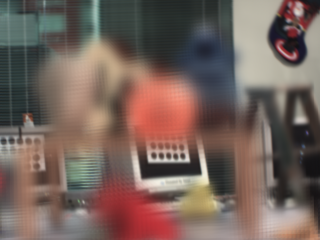
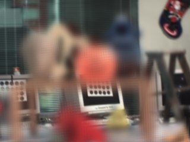

## Traditional Light Field Rendering

​		In this project, we implement novel-view synthesis results based on traditional light field rendering. There are more concrete problems that have been solved.

- Implement both bilinear and quadra-linear interpolation schemes to interpolate views along 𝑥 and 𝑦 directions. 
- Implement focussing and defocussing by variable focal plane and variable aperture size. 
- Implement the z-directional motion of the camera by expanding field of view.


## Experiment


````python
# interpolation
python src/main.py -t 1 -i b
python src/main.py -t 1 -i q
````

````python
# undersampled
python src/main.py -t 2
````

````python
# variable_focal_plane
python src/main.py -t 3 
````

````python
# variable_aperture_size
python src/main.py -t 4
````

````python
# expand_field_of_view
python src/main.py -t 5 
````

​	See your results in "./results" or you can watch demo videos in "./video"

## Demos

### Bilinear Interpolation


### Quadra-linear Interpolation


### Variable Focal Plane






